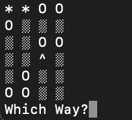

Find My Hat Game
=======
I am going to create an interactive terminal game. The scenario is that the player has lost their hat in a field full of holes. They must navigate back to their hat without falling down one of the holes, or stepping outside of the field. 

## Table of contents 
* [General Information](#general-information)
* [Technologies](#technologies)
* [Setup](#setup)
* [Illustrations](#Illustrations)
* [How to play](#how-to-play)
* [Project Status](#project-status)
* [Sources](#sources)

## General Information 

I will be building an interactive terminal game using JavaScript classes. The game will need  user input, in Node.js, to be played. 
I will be testing my code in the terminal with the command:
`node /Find-My-Hat-Game/main.js`

## Technologies 

* JavaScript 
* Node.js
* Git
* GitHub

## Setup 

To run the game on your computer, you will need to have node.js installed.     
You will need to have the command line on your own computer set up.     
Node can be downloaded from the [Node website](https://nodejs.org/en/).     
For more information on this, please see this [link](https://www.codecademy.com/articles/setting-up-node-locally) 

## Illustrations

This is full game play: 

 
Some examples of other gameplay features: 

## How to play 

Once node is intalled on your computer, and the files are downloaded, you are ready to play the game: 
* Load the game with this command in the termial: `node /Find-My-Hat-Game/main.js`    
You need to use the file path to the game, which will be unique to your computer. 
* The game field will appear, and the question which way? 
* You are the * character, in the top left hand corner. 
* You need to direct yourself to the ^ hat.    There will be only one hat on the screen, and it will be in a different location each time. 
* The neutral background ░ is the field. 
* The holes are represented with 0.     If you land on a hole, you fall down it and the game is over. 
* To direct yourself, when asked enter, `U` for up, `L` for left, `R` for right, `D` for down and `End` to end the game. 

## Project Status

Project Status: *In Progress* 

As I work through my project, I will add my to-do's below: 
* I need to fully test all fail and results. If the user steps off the board in any direction, I need to add the functionality for all circumstances to result in a lose/ win when appropriate.
* Also I can add some validation, so the hat can't generate on the path character.  

fieldCharacter = ░
hat = ^ 
holes = 0
pathCharacter = *

If I come accross improvements, or future updates, I will add them below: 
* One update could be having the player character start at a random location on the board. 
* Adding holes after a player has made a certain amount of moves. This would be interesting to create and could be like hard mode. 
* I can improve the graphics in the terminal. This is something I haven't done before and I am interesed to see how creative I can make my game. 
* Make a maze solver. So I can validate my fields before they get played. 

## Sources

* This Project has been created with Codecadamy's [full stack engineer path](https://www.codecademy.com/learn/paths/full-stack-engineer-career-path).
* I have found this [codecadamy guide](https://www.codecademy.com/articles/getting-user-input-in-node-js) on User Input with Node.js incredibly helpful. 
* This Readme.md file was created using [this cheatSheet](https://github.com/adam-p/markdown-here/wiki/Markdown-Cheatsheet). 